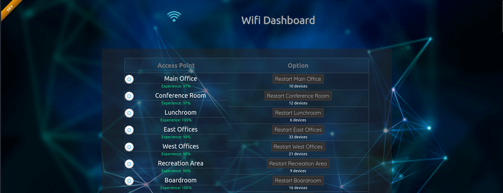
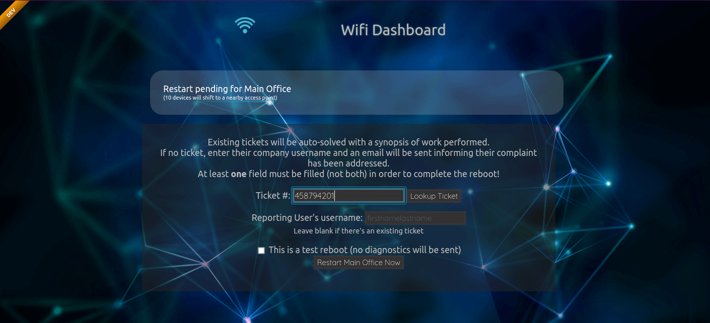

# Unifi Helpdesk Dashboard with Zendesk Integration
Pull data from the Unifi controller with reboot controls for Ubiquiti access points by non-admin helpdesk techs.

- **Features:**
  - Allow your helpdesk to easily reboot Ubiquiti access points linked to a Unifi controller, without requiring access to the controller itself
  - Auto-close Zendesk tickets by simply specifying the ticket number during the reboot
    - Or, send an email to the reporter that their issue was addressed
  - Auto-detect production/development environment & show a banner in the upper-left corner, for easy visual differential

Working on (time permitting):
  - Collect diagnostics of access points that had to be rebooted by helpdesk

Access Point List: 

Reboot Initialization:

:warning: Don't set this up on a public or internet-facing server.  It should be used on an isolated vlan for helpdesk/staff only; restricted by IP and not accessible from the external internet.

It's purpose is to be as simple as possible, hence why there's no login system.

***

- [Setup](setup.md) - Instructions on how to configure and daemonize the app
- [Configuration](configure.md) - Explanation of the yaml config file

***

## Other applications you may find useful:
- [Wifi Network Testing](https://github.com/angela-d/wifi-network-testing) - Scan your wifi network and obtain troubleshooting details, with extreme granularity - using a colorful command-line tool.

- [Unifi Controller Monitoring w/ PRTG](https://github.com/angela-d/prtg-unifi-controller-ubiquiti-monitoring) - Monitor Unifi controller and Ubiquiti wifi access points through PRTG. 

- [Wifi Channel Watcher](https://github.com/angela-d/wifi-channel-watcher) - Monitor channel usage of neighboring routers & get an alert if your active channel is not optimal. Troubleshoot wifi without lifting a finger! 

### Credits
Wifi SVG icon by [zuozuozuozuozuozuo](https://www.veryicon.com/icons/food--drinks/miscellaneous-grain-collection/wifi-105.html)

Networking wallpaper from [Get Wallpapers](https://getwallpapers.com/collection/network-wallpaper)